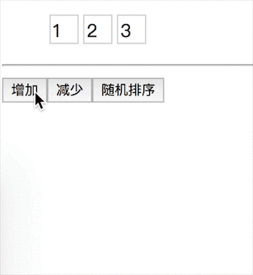

# react-flip-animate [](https://www.npmjs.com/package/react-flip-animate)

FLIP （First-Last-Invert-Play）动画组件<br/>
自己实现了一个，不建议用于生产，我暂时还没做太多测试，只是想自己研究一下FLIP。

### 示例



### 安装和使用

```javascript
yarn add react-flip-animate

import Flip from "react-flip-animate";

const data = [1,2,3];

<Flip>
  {(()=>{
    return data.map(item => <div key={item}>{item}</div>)
  })()}
</Flip>
```

### 注意
* 每个子元素需要一个唯一的key值，不要用data.map((item,index)=>...)中的index作为key，react的虚拟DOM会复用已存在的DOM元素。所以建议用数据中的id或者数据本身作为key值

### 参数

| 参数名     | 类型   | 默认值 | 说明                                          |
| ---------- | ------ | ------ | --------------------------------------------- |
| tag        | String | "div"  | 指定生成的包裹标签，<Flip>默认被渲染为一个div |
| speed      | Number | 300    | 动画速度，单位：ms                            |
| className  | String | null   | 组件的class，会自动附加给<Flip>顶层容器       |
| transClass | String | null   | 自定义元素进入和离开的class                   |

### 例子

```javascript
  import "./index.less";

  <Flip
    tag="ul"
    speed={500}
    transClass="hello"
  >
    <li key="a">...</li>
    <li key="b">...</li>
  </Flip>

  # index.less:

    hello-enter{ // 定义一个元素在被插入之前的初始状态
      opacity: 0;
      transform: translateY(20px);
    }

    hello-leave{ // 定义一个元素在离开之后的最终状态
      opacity: 0;
      transform: translateY(-20px);
    }
```

### 说明

* 只支持opacity和transform的变换
* 元素被插入后的状态一律是```opacity:1; transform:translate(0,0);```